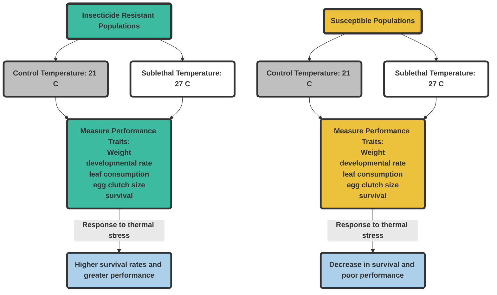

```mermaid

graph TD

A(<b>Insecticide Resistant Populations)
B(<b>Susceptible Populations)
A --> C(<b>Sublethal Temperature: 27 C)
A --> D(<b>Control Temperature: 21 C)
B --> F(<b>Sublethal Temperature: 27 C)
B --> E(<b>Control Temperature: 21 C)
D--> G(<b>Measure Performance Traits:<br>Weight<br>developmental rate<br>leaf consumption<br>egg clutch size<br>survival)
C-->G
E-->H(<b>Measure Performance Traits:<br>Weight<br>developmental rate<br>leaf consumption<br>egg clutch size<br>survival)
F-->H
H-->|<b>Response to thermal stress|I(<b>Decrease in survival and poor performance)
G-->|<b>Response to thermal stress|J(<b>Higher survival rates and greater performance)
style A fill:#3cbba0,stroke:#333,stroke-width:5px;
style B fill:#ecc13c,stroke:#333,stroke-width:5px;
style C fill:#ffffff,stroke:#333,stroke-width:4px;
style D fill:#bfbfbf,stroke:#333,stroke-width:4px;
style E fill:#bfbfbf,stroke:#333,stroke-width:4px;
style F fill:#ffffff,stroke:#333,stroke-width:4px;
style G fill:#3cbba0,stroke:#333,stroke-width:4px;
style H fill:#ecc13c,stroke:#333,stroke-width:4px;
style I fill:#acd0ea,stroke:#333,stroke-width:4px;
style J fill:#acd0ea,stroke:#333,stroke-width:4px;
```

