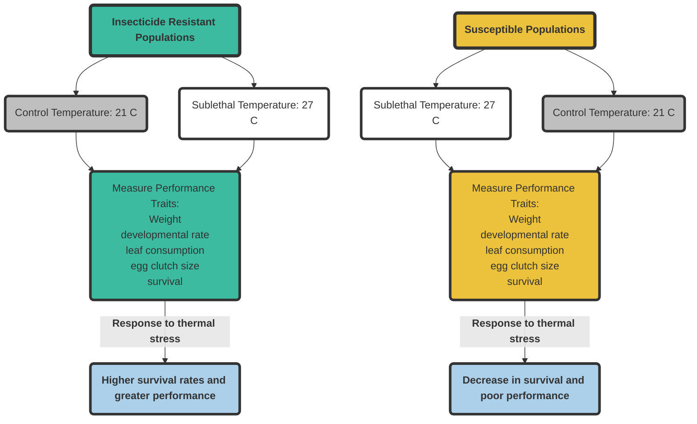

```{r setup, include=FALSE}
knitr::opts_chunk$set(echo = TRUE)
```
###How does sublethal heat stress influence phenotypic variation in resistant and susceptible Colorado potato beetle populations?


### [Link to my charts](typoralab2.html)

#My flowchart illustrates an experimental design to address the effects of thermal stress between resistant and susceptible beetles.  I hypothesize that resistant CPB populations which have a long history of exposure to pesticides will be more capable of adapting to heat and pesticide stress than beetles from susceptible CPB populations. The data gathered from this experiment will provide a baseline for characterizing differences in levels of adaptability among susceptible and resistant populations while also providing valuable information on the nature of stress responses in CPB.
#The second image shows three different types of pre graphs that I expect to see after my experiments are completed. The first one is a bar graph or mean adult weight in response to temperature treatments (21 and 27 C) for both susceptible and resistant beetles. The second set of charts are survival curves for both temperature temperature treatments per population type. The last chart is a line graph for developmental rates for resistant beetles over time.
