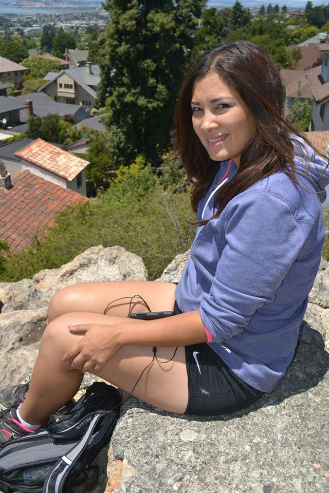
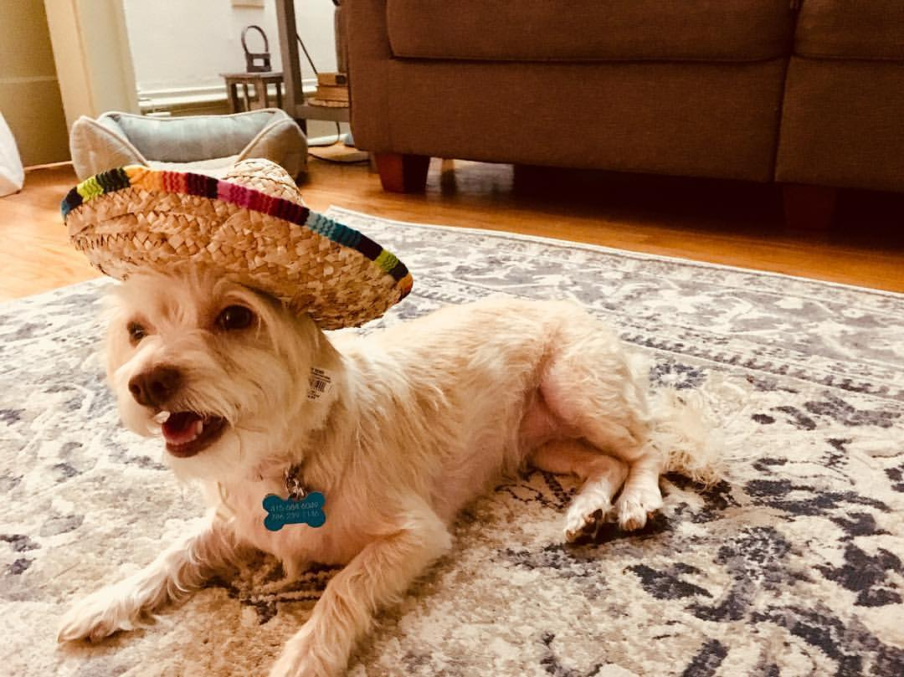

###Assingments
####[1: Setting up a webpage](https://eribue.github.io/COMP-BIOL/) 

####[2: Typora Diagrams](Lab2.html)

####[3: Beamer Presentations](Lab3.pdf)

####[4: Vectors in R and Regular Expressions](Lab4.html)

####[5: Manipulating Data using dplyr](Lab5.html)

####[6: Data distributions](Lab6.html)

####[7: Creating Fake Datasets to Explore Hypotheses](Lab7.html)

####[8: Organizing Code with Structured Programming](Lab8.html)

####[10: For Loops and Randomization Tests](Lab10.html)

####[11: Advanced ggplotting](Lab11.html)

###Presentations

####[Sushi R Package for visualizing genomic data](SushiPresentation.html)

####[Paper describing Sushi: Phasientel et al. 2018](https://www.ncbi.nlm.nih.gov/pmc/articles/PMC4173017/)

###Links to useful sites

####[How to use PaletteR to make custom palettes](https://datascienceplus.com/how-to-use-paletter-to-automagically-build-palettes-from-pictures/)

####[ggplot2: Plotting tutorial](https://www.mailman.columbia.edu/sites/default/files/media/fdawg_ggplot2.html)

####[File Format Info](https://genome.ucsc.edu/FAQ/FAQformat.html)
####[Genome Browser Info](http://homer.ucsd.edu/homer/basicTutorial/genomeBrowsers.html)

###[Follow my dog, Rooby, on instagram:](https://www.instagram.com/rooby_the_spicymeatball/)

